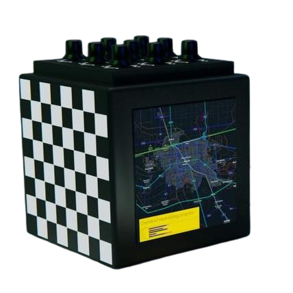

# AetherOnePi
## Flux Version

The Flux Version of AetherOnePi is an historical reproduction of the original prototype from 2015, but with a modernized UI.

You need Java 24 to run this.

## What does AOPi mean?
- AOPi = AetherOnePi
- AOPi = Alpha Omega Pi
- AOPi = Aether One Pi
# What is AetherOnePi?
A free and open source Radionics Software, written in Java, using libGDX as a rendering library.

## What is Radionics?
Radionics is essentially Computer Aided Psionics. It helps to analyze pre-material imbalances of energy fields.
And it assists in broadcasting intention and information to these fields. It is a spiritual art.
